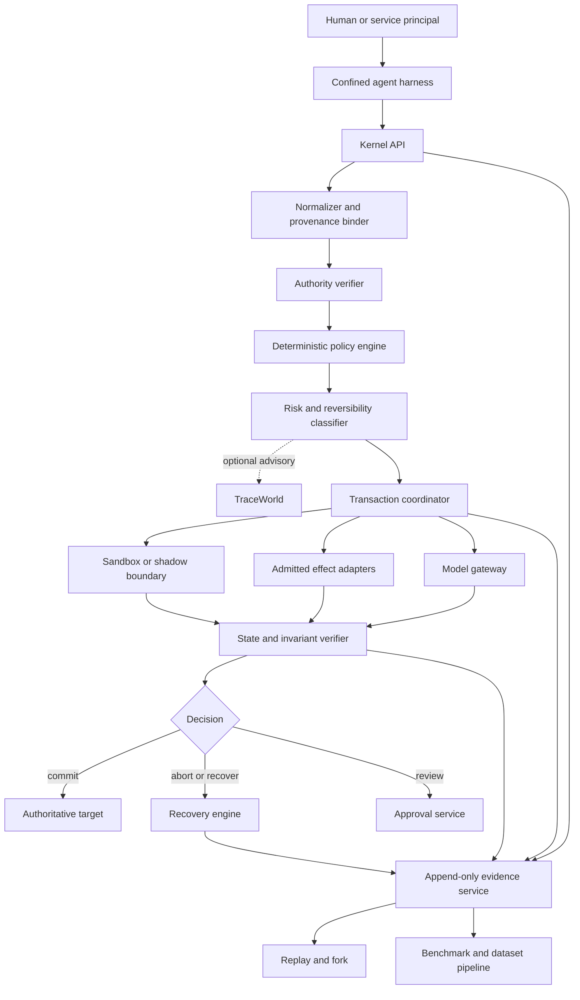

# AgentKernel Architecture

- **Document status:** target architecture with a Phase 0 implementation boundary
- **Last reviewed:** 2026-07-21

This document explains how AgentKernel separates an agent's proposal from an authoritative effect. It is an architectural contract and planning aid, not evidence that every component exists. The repository currently contains the Phase 0 foundation plus a bounded `A0` filesystem vertical slice and a separate Docker control probe; consult the [roadmap](../ROADMAP.md) and tests before treating any wider component as implemented.

## Architectural objective

An effectful action should not execute merely because a model emitted a valid tool call. The runtime is designed to establish:

1. where the proposal and its inputs came from;
2. which principal granted which bounded authority;
3. which deterministic policies apply;
4. where uncertain work will execute;
5. which state transition is expected and how it will be verified;
6. how failure, ambiguity, and recovery will be represented; and
7. which evidence supports the final outcome.

The architecture does not attempt to infer perfect human intent or prove universal safety.

## Core principles

- **Deny by default.** Missing authority or required evidence is not implicit permission.
- **Authority is not information.** Files, pages, messages, tool output, and model output cannot create grants.
- **Capabilities attenuate.** Delegation may narrow authority, never silently broaden it.
- **No effect without a typed adapter.** Effect domains and recovery semantics must be declared before execution.
- **Stage is not commit.** For `R1+` actions, isolated execution must not mutate the authoritative target.
- **Verify state, not rhetoric.** A worker's success message is evidence, not the final transaction decision.
- **Represent ambiguity.** An uncertain external result becomes `IN_DOUBT`, not an unsafe retry.
- **Preserve evidence outside worker authority.** Task rollback must not erase audit history.
- **Learned models are advisory.** They may increase caution but cannot grant authority or override denial.
- **State assurance precisely.** Every report names achieved, degraded, unavailable, and unobserved controls.

## System context

This is the target system context. The current code implements the foundation contracts, embedded transaction coordinator, SQLite journal, filesystem and mock adapters, policy/authority checks, a local-only model gateway, and a Docker control backend. External model dispatch is hard-disabled until durable intent and reconciliation exist. The diagram does not imply that a confined agent harness, integrated `A2` path, other effect domains, or distributed services are currently available.

## Four planes

| Plane | Responsibilities | Must not silently own |
| --- | --- | --- |
| Control | Identities, capability issuance, policy, transaction decisions, approval, scheduling | Untrusted action execution |
| Execution | Sandbox workers, shadow environments, admitted adapters, brokered effects | Policy mutation, approval, capability issuance, prior evidence |
| Evidence | Append-only events, artifacts, snapshots, receipts, state diffs, replay fixtures | Authoritative action decisions based only on worker claims |
| Research | Benchmarks, fault schedules, datasets, TraceWorld training/evaluation | Runtime authority or deterministic policy override |

Production-oriented designs should use separate identities and narrow protocols between planes. Process separation is introduced when justified by threat model or failure isolation; Phase 0 should avoid premature microservices.

## Trust boundaries

### Intended trusted computing base

The initial trusted computing base is expected to include:

- schema validation and canonical resource normalization;
- provenance binding and capability validation;
- deterministic policy compilation/evaluation;
- transaction state and recovery journal;
- admitted adapter code, manifests, and adapter-host boundary;
- model-egress gateway and secret broker;
- approval validation;
- event hashing/signing/checkpoint logic; and
- sandbox configuration validation and launcher.

An admitted adapter is trusted code. A signature identifies code; it does not prove that code is honest. The base design does not claim resistance to a deliberately malicious adapter already admitted to the trusted computing base.

### Untrusted by default

- model output and model-generated code;
- repository, web, document, email, database, and tool content;
- third-party frameworks and plugins;
- code inside an execution sandbox;
- remote services and their success messages;
- benchmark payloads and submissions; and
- TraceWorld predictions.

For any future `A1+` profile, the agent framework must have no ambient host filesystem, process, device, credential, provider, or raw-network path. SDK cooperation alone is not an enforcement boundary. Until OS/network bypass tests prove that confinement, the integration is `A0` development/inspection only.

## Logical components

| Component | Contract |
| --- | --- |
| `KernelAPI` | Accepts authenticated goals, proposals, transaction commands, deadlines, and idempotency keys. |
| Normalizer | Validates typed input, resolves canonical resources without broad access, expands declared effects, and computes an intent identity. |
| `AuthorityService` | Validates the full capability/delegation chain and returns the effective intersection. |
| `PolicyService` | Evaluates all applicable bundles with deny dominance, cumulative obligations, intersected constraints, and fail-closed unknowns. |
| Risk classifier | Applies deterministic risk floors (`R0`–`R4`) and required handling. Optional model output can only elevate caution. |
| `TransactionService` | Owns durable states, compare-and-swap versions, leases/fencing, idempotency, dispatch journals, reconciliation, and terminal decisions. |
| `ExecutionBroker` | Dispatches scoped work to a sandbox or admitted adapter worker using short-lived authority. |
| `ModelGateway` | Treats external inference as irreversible data egress, preserves provenance, brokers credentials, enforces destination/data/budget policy, and records redacted receipts. |
| Verifier | Evaluates adapter, resource, task, security, and cross-action invariants independently of model-generated code. |
| Recovery engine | Journals and verifies abort, rollback, compensation, reconciliation, or quarantine. |
| `ApprovalService` | Binds a human decision to the exact intent, diff, principal, transaction version, scope, and expiry. |
| `EvidenceService` | Appends events and stores content-addressed artifacts outside worker authority. |
| Replay service | Reconstructs only declared inputs/nondeterminism and defaults to a non-authoritative, no-egress target. |
| Benchmark service | Provisions synthetic environments, injects controlled faults, and grades final state read-only. |
| TraceWorld service | Produces optional risk/localization/recovery predictions without authority. |

These boundaries may initially be Python interfaces in one process. Their dependency direction must still prevent adapters, workers, integrations, and research code from owning control-plane decisions.

## Proposal-to-effect lifecycle

1. An authenticated principal registers a goal and explicit bounded grants.
2. The agent submits a typed proposal with provenance, authority references, deadline, and transaction context.
3. The normalizer validates and canonicalizes the proposal and computes an `intent_hash`.
4. Authority is reduced to the intersection of the complete delegation chain.
5. Every applicable policy layer is evaluated; denial dominates and obligations do not grant permission.
6. Deterministic risk/reversibility sets the minimum handling. Optional predictions may require more caution.
7. Before any `R1+` action, the coordinator journals recovery and dispatch intent.
8. The adapter stages or executes only in the declared isolated boundary.
9. Independent verification returns `PASS`, `FAIL`, `UNKNOWN`, or `ERROR`; unknown is never silently pass.
10. Required approval is bound to the exact staged intent and diff.
11. Immediately before commit, authority, policy, approval, adapter digest, idempotency, and target version are revalidated.
12. Only the adapter's explicit `commit`/promotion method may create the authoritative `R1+` effect.
13. Committed state is verified; ambiguity triggers reconciliation rather than duplicate dispatch.
14. Every transition and evidence reference is appended outside worker authority.

## Transaction model

The durable lifecycle distinguishes planning, staging, commit, ambiguity, and recovery. Important properties include:

- `STALE_STATE` is the only durable version-mismatch outcome; a replan creates a linked transaction.
- `COMMITTING` is entered only after commit intent is durably journaled.
- `IN_DOUBT` blocks automatic redispatch of the same intent.
- `FAILED`, `IN_DOUBT`, and `RECONCILING` are non-terminal because further classification or recovery is required.
- Terminal history is append-only. Later compensation of a committed transaction is a separately authorized linked transaction.
- `ROLLED_BACK` means the declared original state was restored and verified; `COMPENSATED` must state residual effects.
- `RECOVERY_FAILED` and `COMPENSATION_FAILED` are visible terminal outcomes, not hidden errors.

Multi-resource atomicity is not assumed. A snapshot profile may claim atomicity only within its supported boundary; heterogeneous systems normally require a saga with durable per-action records and reverse dependency recovery. Best-effort partial effects require explicit policy acceptance.

## Data and evidence

Durable public records are versioned and strict. Canonical serialization follows [ADR-0001](adr/0001-canonical-json.md). Content identity uses SHA-256 with an algorithm prefix.

Evidence events are intended to include schema version, globally unique ID, run/transaction identity, authoritative sequence, logical and wall time, event type, actor, on-behalf-of principal, payload, artifact references, prior hash, current hash, and optional signature reference.

Hash chaining detects mutation or reordering inside the observed chain, but cannot by itself prove that the newest unchecked suffix was not deleted. Stronger deployments require signed checkpoints in an independently controlled store. Plaintext secrets must not enter general events, logs, metrics labels, or replay exports.

## Deployment profiles

| Mode | Intended use | Current status |
| --- | --- | --- |
| Embedded | Unit tests and bounded `A0` transactional filesystem demo; no enforcement claim | Implemented vertical slice |
| Local developer | Confined harness, local control plane, OCI workers, local stores | Docker control probe implemented; integrated harness planned for `0.1` |
| Team server | Shared internal use with PostgreSQL, object storage, worker pool, and identity provider | Planned |
| Research cluster | Benchmark scheduling, datasets, training, experiment registry | Planned |
| High isolation | Stronger sandbox/microVM, separated networks and keys | Future profile, not a current claim |

Linux x86-64 is the reference platform for security and production profiles. Windows and macOS may support foundation development or mock backends. Missing controls must cause a visible downgrade or refusal.

## Dependency rules

- Domain models do not import adapters, web frameworks, or database implementations.
- Authority and policy code do not call language models or arbitrary plugins.
- Adapters do not mutate transaction state or evidence storage directly.
- Workers do not issue capabilities or approvals.
- Benchmark verifiers are read-only after agent termination.
- TraceWorld consumes evidence and remains advisory.
- Framework integrations depend on public contracts rather than internal stores.

Architecture tests should enforce these directions as the package grows.

## Material decisions

Changes to trust boundaries, authority, policy aggregation, transaction semantics, stage/commit separation, assurance claims, evidence identity, secrets, model egress, or replay require an ADR. Start with [ADR-0000](adr/0000-template.md).
